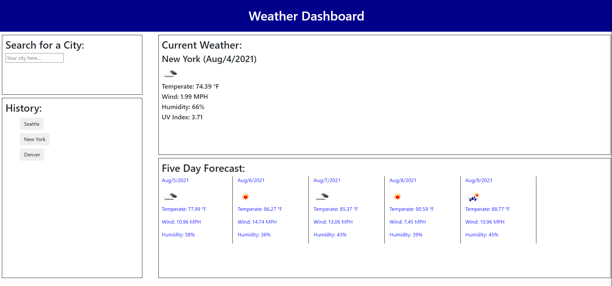

# Weather Data Service - Unit 6

## Description

This project was made with the intent of getting updates on the weather for a searched location using OpenWeatherAPI. This API only allows states in the US however it will accept country names. Overall design was pretty simple as I wanted it to have the ability to search for a location, display the current weather, display the next five days weather, and to save the searches to a history. I started with the search history as I felt most comfortable working with local storage. This was pretty simple as I just saved the form value to an array that is pushed and pulled from local storage whenever needed. Next I worked on fetch requests this is where I discovered the requirements that the weather API had for fetching information as well as the query parameters each section would take. For this I had to use a fetch request to take a location name and retrieve the latitude and longitude of the location, which is then able to be fetched from a seperate request that has parameters to return the proper units so we can use fahrenheit when displaying to the page. From there I used two different functions append items to the page in 2 seperate div elements that were used to display the current forecast and the five day forecast of the location that was searched. A struggle at this point was getting the proper date to display, at first I used moment.js. However, I quickly realized this was not the best solution as the data that is retrieved would retrieve a date and time in unix code. Using javascripts attribute date we are able to multiple that number by 1000 and decide what we pull from the value which ended up being the month, day, and year. With this we concat all in a seperate variable and use that to display to the page. 

## Links
[Deployed-Site](https://niklasertle.github.io/nje-weather-checker/)

